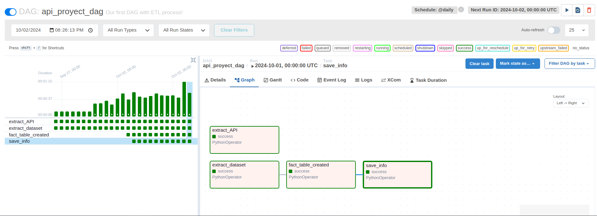
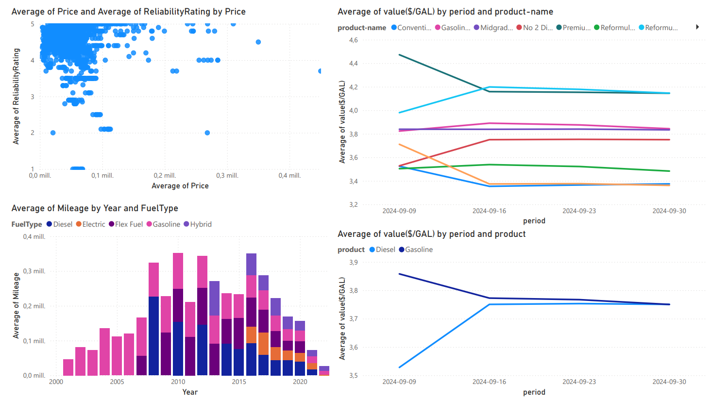
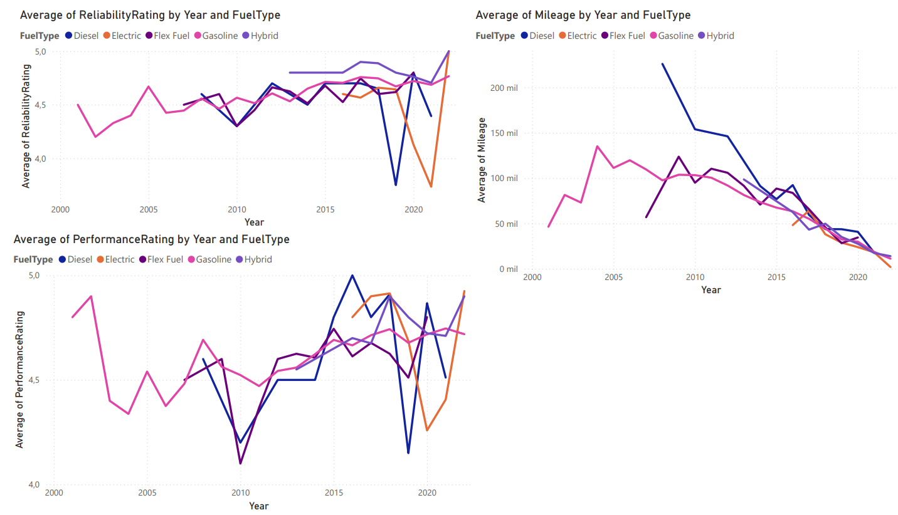

# README

# Structure

```bash
API/
├── dags/
│   ├── ETL-process.py
│   ├── extractData.py
│   ├── save_DB.py
│   ├── transform.py
│   ├── apiCall.py
│   └── EDA_API.ipynb
├── Dashboard/
│   ├── Proyect-ETL.pdf
│   └── proyect2_dashboard.pdf
├── Data/
│   ├── Clean/
│   └── Raws/
│── data-README.md/
├── Document/
│   ├── Proyecto ETL1.pdf
│   └── Proyecto ETL2.pdf
├── .gitignore
├── connection.py
├── EDA.ipynb
├── fact-dimensions.ipynb
├── poetry.lock
├── pyproject.toml
└── README.md

```

# **Context**

The project is based on a study of the different cars bought and sold in the United States, seeking to show how the automotive market behaves and to know the preferences of local consumers, to know if there is any variable that affects the acquisition of a car such as Geographic location affects the purchasing decision, brand, color, among others. The chosen data set consists of the cars.com page for the sale of second-hand and new cars, published by people and car dealers. We got the code from: [https://www.kaggle.com/datasets/chancev/carsforsale/data](https://www.kaggle.com/datasets/chancev/carsforsale/data)

The key steps in this project include:

Clean the dataset through an EDA process. Migrating the cleaned data to a PostgreSQL database for further analysis.

For this project, use Python and Jupyter Notebook, choosing PostgreSQL as the database to manage and query the clean data.

---

# Technologies

- Python
- Jupyter
- Ubuntu
- Apache-Ariflow
- Poetry
- Git y Github
- PowerBI
- SQLalchemy
- Pandas
- Dontev
- PostgreSQL

---

# Members

Santiago Gomez Castro

Juan Carlos Quintero

MIguel Angel Ruales

---

# Installation

After did git clone enter to directory:

```bash
# If you don't have poetry
sudo apt install python3-poetry 
```

```bash
poetry shell
```

```bash
poetry install 
```

```python
export AIRFLOW_HOME=$(pwd)/airflow
```

```python
export AIRFLOW__CORE__LOAD_EXAMPLES=false
```

```python
AIRFLOW_VERSION=2.10.1
PYTHON_VERSION="$(python -c 'import sys; print(f"{sys.version_info.major}.{sys.version_info.minor}")')"
CONSTRAINT_URL="https://raw.githubusercontent.com/apache/airflow/constraints-${AIRFLOW_VERSION}/constraints-${PYTHON_VERSION}.txt"
pip install "apache-airflow==${AIRFLOW_VERSION}" --constraint "${CONSTRAINT_URL}"
```

```python
airflow standalone
```

Open browser and copy and paste the link:

```python
airflow webserver --port 8080

```

---

# Airflow

Airflow is used for the creation of a pipeline, where it performs the extraction, transformation, and loading of the data.



---

# **Dashboard**



