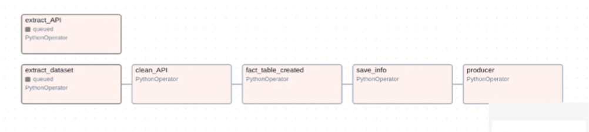
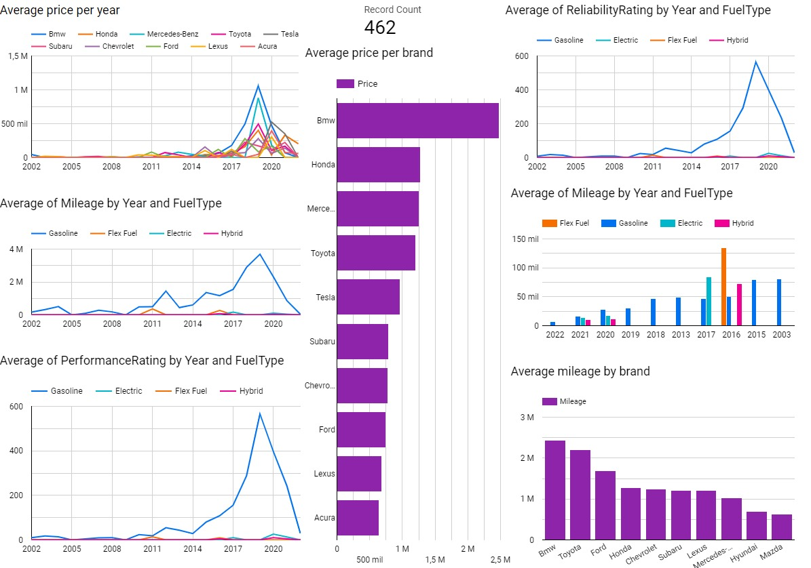
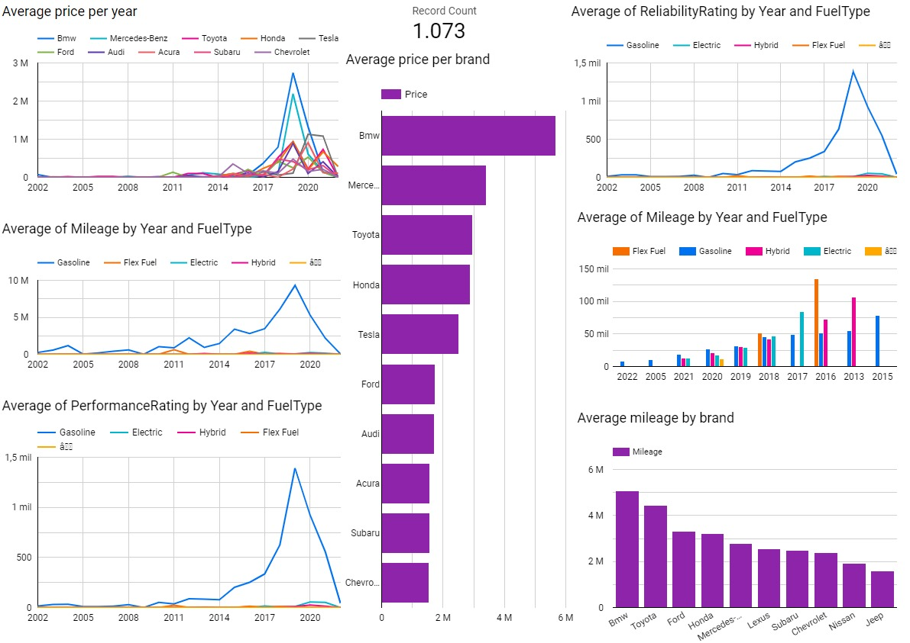
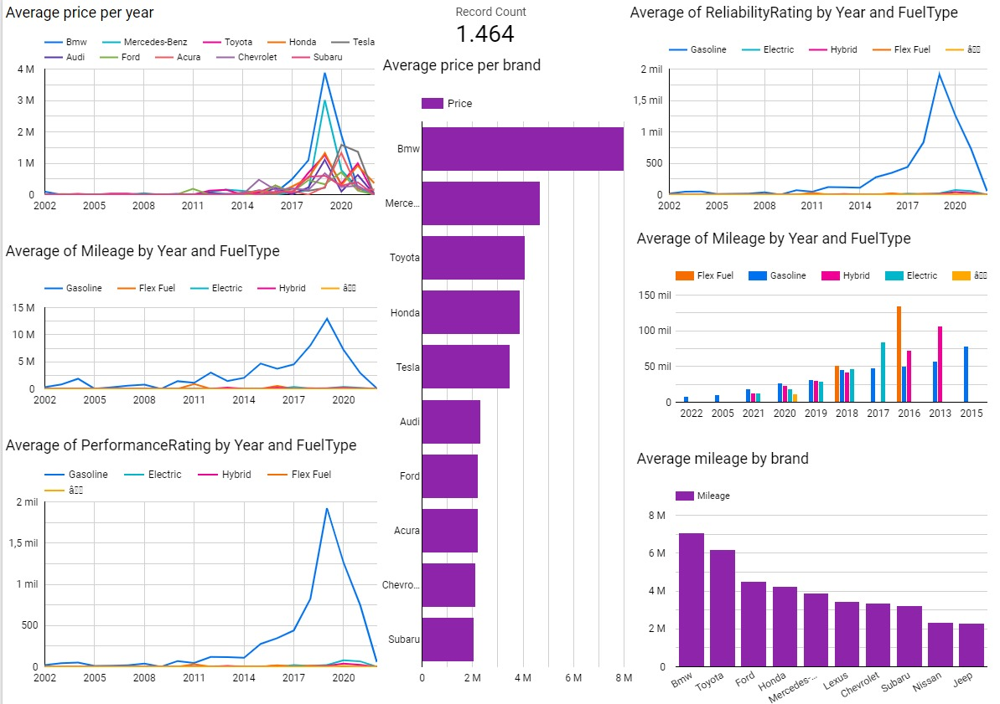

# ETL Project - Vehicle Data Cleaning and Analysis
This repository details our process of ETL, data analysis, and visualization using Python and PostgreSQL, focusing on vehicle data to extract valuable insights.

# Structure

```bash
PROYECT-CARS-ETL
├── API
│   ├── dags
│   ├── apiCall.py
│   └── EDA_API.ipynb
├── Dashboard
├── Data
│   ├── Clean
│   └── Raws
├── data-README.md
├── Document
├── src
├── Video
├── .env
├── .gitignore
├── connection.py
├── docker-compose.yml
├── EDA.ipynb
├── fact-dimensions.ipynb
├── poetry.lock
├── pyproject.toml
└── README.md


```

# **Context**

The project is based on a study of the different cars bought and sold in the United States, seeking to show how the automotive market behaves and to know the preferences of local consumers, to know if there is any variable that affects the acquisition of a car such as Geographic location affects the purchasing decision, brand, color, among others. The chosen data set consists of the cars.com page for the sale of second-hand and new cars, published by people and car dealers. We got the code from: [https://www.kaggle.com/datasets/chancev/carsforsale/data](https://www.kaggle.com/datasets/chancev/carsforsale/data)

The key steps in this project include:

Clean the dataset through an EDA process. Migrating the cleaned data to a PostgreSQL database for further analysis.

For this project, use Python and Jupyter Notebook, choosing PostgreSQL as the database to manage and query the clean data.

---

# Technologies

- Python
- Jupyter
- Ubuntu
- Apache-Ariflow
- Poetry
- Git y Github
- PowerBI
- SQLalchemy
- Pandas
- Dontev
- PostgreSQL

---

# Members

Santiago Gomez Castro

Juan Carlos Quintero

MIguel Angel Ruales

---

# Installation

After did git clone enter to directory:

```bash
# If you don't have poetry
sudo apt install python3-poetry 
```

```bash
poetry shell
```

```bash
poetry install 
```

```python
export AIRFLOW_HOME=$(pwd)/airflow
```

```python
export AIRFLOW__CORE__LOAD_EXAMPLES=false
```

```python
AIRFLOW_VERSION=2.10.1
PYTHON_VERSION="$(python -c 'import sys; print(f"{sys.version_info.major}.{sys.version_info.minor}")')"
CONSTRAINT_URL="https://raw.githubusercontent.com/apache/airflow/constraints-${AIRFLOW_VERSION}/constraints-${PYTHON_VERSION}.txt"
pip install "apache-airflow==${AIRFLOW_VERSION}" --constraint "${CONSTRAINT_URL}"
```

```python
airflow standalone
```

Open browser and copy and paste the link:

```python
airflow webserver --port 8080

```

---

# Airflow with kafka producer

Airflow is used for the creation of a pipeline, where it performs the extraction, transformation, and loading of the data.



[Watch the video on Google Drive](https://drive.google.com/file/d/1KGBqOMcxN3Y5TbdSVWPkXpBkCVWXVRXZ/view?usp=sharing)

Before running Kafka, we need to use some additional commands:

```python
pip install git+https://github.com/dpkp/kafka-python.git
```

launch Docker with:

```bash
docker compose up
```

If you don't have Docker, go to the next [Link](https://www.docker.com/g) and download

Open Docker bash:

```bash
docker exec -it kafka-test bash 
```

and paste:

```bash
kafka-topics --bootstrap-server kafka-test:9092 --create --topic kafka_project
```

```bash
exit
```

Next we start consumer with:

```python
python3 ./src/consumer.py
```

---
## Data Validation with Great Expectations  

This project uses **Great Expectations** to ensure the quality of data retrieved from the `extract_API` stage before further processing. The validation file is a Jupyter Notebook "testin_extractData.ipynb", in the GX folder.

### Validations Performed  
1. **Column Structure**: Ensures the retrieved columns match the expected schema.  
2. **Data Types**: Verifies that each column has the correct data type.  
3. **Missing Values**: Checks that no columns contain null values, except for the `value` column (as it may contain nulls before data cleaning).  

### Setup  
Make sure to initialize a Great Expectations project before using the notebook by running:  
```bash
great_expectations init
```

---

# **Dashboard**

This is our dashboard which we keep updating trought the time.






