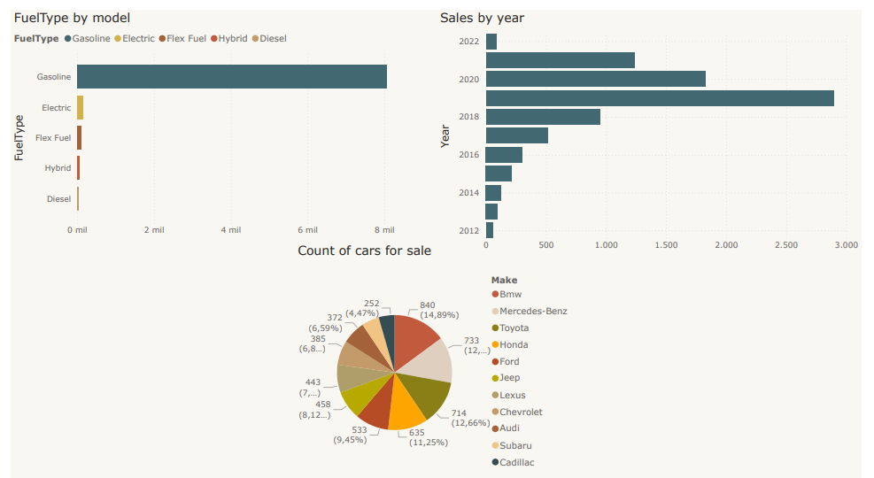
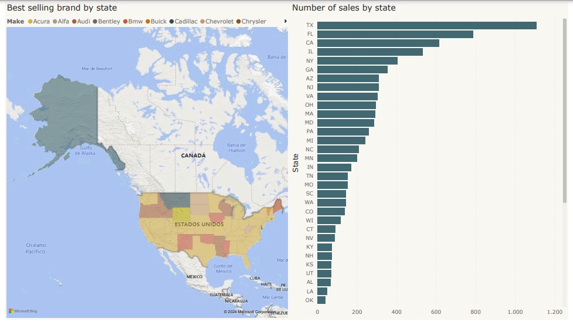

# ETL Project - Vehicle Data Cleaning and Analysis
This repository details our process of ETL, data analysis, and visualization using Python and PostgreSQL, focusing on vehicle data to extract valuable insights.

# Context
The project is based on a study of the different cars bought and sold in the United States, seeking to show how the automotive market behaves and to know the preferences of local consumers, to know if there is any variable that affects the acquisition of a car such as Geographic location affects the purchasing decision, brand, color, among others.
The chosen data set consists of the cars.com page for the sale of second-hand and new cars, published by people and car dealers.
We got the code from: 
https://www.kaggle.com/datasets/chancev/carsforsale/data 

The key steps in this project include:

Clean the dataset through an EDA process.
Migrating the cleaned data to a PostgreSQL database for further analysis.

For this project, use Python and Jupyter Notebook, choosing PostgreSQL as the database to manage and query the clean data.

### Dashboard

these are our results